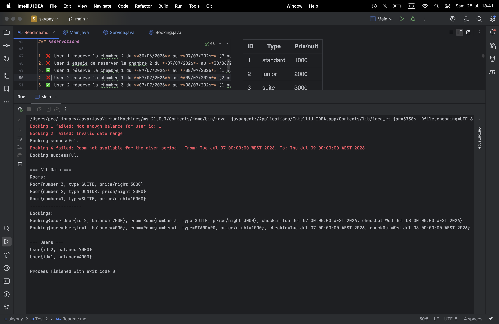

# Skypay Technical Test 2 – Système de Réservation d’Hôtel

##  Résumé

Ce projet est une implémentation simplifiée d’un système de réservation d’hôtel en Java. Il gère trois entités principales :

- **Room** : Chaque chambre a un type (standard, junior, suite) et un prix par nuit.
- **User** : Chaque utilisateur a un solde.
- **Booking** : Lien entre un utilisateur et une chambre pour une période donnée.

---

## Les exigences fonctionnelles

- Un utilisateur peut réserver une chambre pour une période donnée **si le solde est suffisant** et **la chambre est disponible**.
- Créer une chambre **si elle n'existe pas** et la modifier.
- Créer un utilisateur **si il n'existe pas** et la modifier.
- Afficher les `chambres` et `réservations` **des plus récentes aux plus anciennes**
- Les données de réservation doivent contenir les **informations complètes** de la chambre et utilisateur au moment de la réservation.
- Affiche les utilisateurs **du plus récent au plus ancien**.
- La gestion des exceptions.

## Les exigences non fonctionnelles
- Performance
---

## Cas de Test Implémenté

### Création des chambres

| ID | Type     | Prix/nuit |
|----|----------|-----------|
| 1  | standard | 1000      |
| 2  | junior   | 2000      |
| 3  | suite    | 3000      |

### Création des utilisateurs

| ID | Solde |
|----|-------|
| 1  | 5000  |
| 2  | 10000 |

### Réservations

1. ❌ User 1 réserve la chambre 2 du **30/06/2026** au **07/07/2026** (7 nuits) – **Échec (solde insuffisant)**
2. ❌ User 1 essaie de réserver la chambre 2 du **07/07/2026** au **30/06/2026** – **Échec (dates invalides)**
3. ✅ User 1 réserve la chambre 1 du **07/07/2026** au **08/07/2026** (1 nuit) – **Réussie**
4. ❌ User 2 réserve la chambre 1 du **07/07/2026** au **09/07/2026** (2 nuits) – **Échec (chambre occupée)**
5. ✅ User 2 réserve la chambre 3 du **07/07/2026** au **08/07/2026** (1 nuit) – **Réussie**

---

## Résultats de la console

###  `printAll()` `printAllUsers()`



---

## Design Questions (Bonus)

### 1. Suppose we put all the functions inside the same service. Is this the recommended approach ? Please explain.

**No**, it is not recommended because : 
- we will have what we call a **Monolith Service** the 
- We will violate one of the solid principals **Single Responsibility Principal (SRP)**.
- It will make code maintenance and tests more difficult.

**A Good design :** will be to separate responsibilities into separate **Services** :
- `RoomService`, `UserService`, `BookingService` each service handling its entity.

---

### 2. In this design, we chose to have a function `setRoom(..)` that should not impact the previous bookings. What is another way ? What is your recommendation ? Please explain and justify.

### Current Approach: Defensive Copying with Linear Search
```java
public void setRoom(int roomNumber, RoomType roomType, int roomPricePerNight) {
    Room existingRoom = findRoomByNumber(roomNumber);  // O(n) linear search
    
    if (existingRoom != null) {
        existingRoom.setType(roomType);
        existingRoom.setPricePerNight(roomPricePerNight);
    } else {
        Room room = new Room(roomNumber, roomType, roomPricePerNight);
        rooms.addFirst(room);
    }
}
```
### Alternative Approach: Using hashmap

```java
public class Service {
    private Map<Integer, Room> rooms = new HashMap<>();
    private Map<Integer, Room> users = new HashMap<>();
    private List<Booking> bookings = new ArrayList<>();

    public void setRoom(int roomNumber, RoomType roomType, int roomPricePerNight) {
        // If this is a new room we create a new Room object and link it to the room number
        // If the room number already exists the newly created room object overwrites
        // the existing one, so when updating a room that exists, it does not change the
        // previous booking.
        roomIds.put(roomNumber, new Room(roomNumber, roomType, roomPricePerNight));
    }

    public void bookRoom(int userId, int roomNumber, Date checkIn, Date checkOut) {
        validateDateRange(checkIn, checkOut);

        User user = this.findUser(userId);
        Room room = this.findRoom(roomNumber);

        checkRoomAvailability(roomNumber, checkIn, checkOut);

        long nights = calculateNights(checkIn, checkOut);
        int totalPrice = (int) (nights * room.getPricePerNight());

        this.chargeUser(user, totalPrice);

        bookings.addFirst(new Booking(user, room, checkIn, checkOut));
        System.out.println("Booking successful.");
    }
}
```

### NB:
`Please correct me if i misunderstood the question.`


